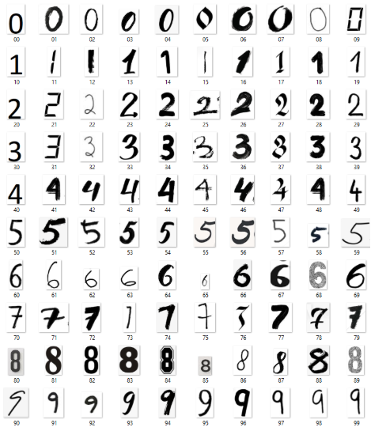
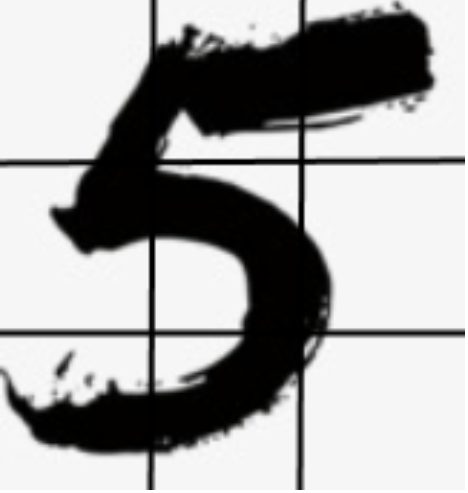
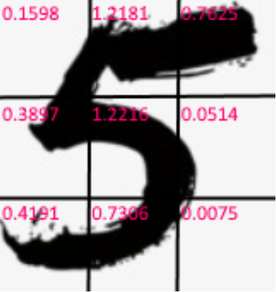
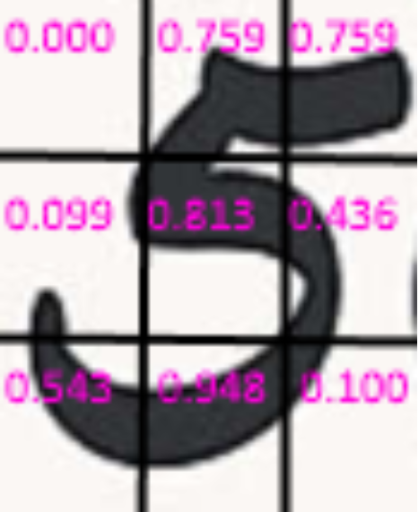
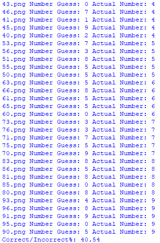

## Image Classifier (Numbers)
An image classifying software programmed in Python. It was programmed alongside two other programmers, Colin Leslie and Kevin Liang. It takes an image of any number between 0 - 9 and identifies it using a classifier algorithm. The algorithm used divides each image into 9 equal parts which is then used to create a feature vector that stores the ratio of black pixels to white pixels for each section. This algorithm uses Machine Learning concepts where a set of images are used to create feature vectors as training data and the rest being used as testing data. The data consists of 100 images of numbers, 10 of each number, 5 of which are randomly selected to be used as training data, and the remaining 50 being used for testing. 

The above shows the images for testing and training. each image is of .png format and varies in colour formats (RGB or Grey). Each image is of a different font to test the robustness of the classifier. 

Each training image is divided into 9 equal sections so that an appropriate feature vector can be created for classifying the testing data. This method will assume that images of the same number will have similar feature vectors (similar ratio of black and white pixels). This method is advantageous for images of different sizes. To further improve this algorithm, future implementations of thinning have been thought of to compensate for different line widths. 

To create the corresponding feature vectors of each image, the ratio of black and white pixels is calculated for each of the 9 sections. The program finds the average ratio of all training data for each digit which is then used in the classification stage. The two images above show the similarity in feature vectors for being the same number but with different fonts. 

Once all the training data has been processed and the corresponding feature vectors have been created, the testing phase begins. In the testing phase, an image is randomly selected out of the remaining 50 and a feature vector is created for that single image. The created feature vector is then compared to all the feature vectors found in the training phase. The vector with the minimum euclidean distance to the testing vector is what the image will be classified as. Each run result will vary as training and testing data is randomly selected each time. The classification rate usually ranges between 30% - 60% 

